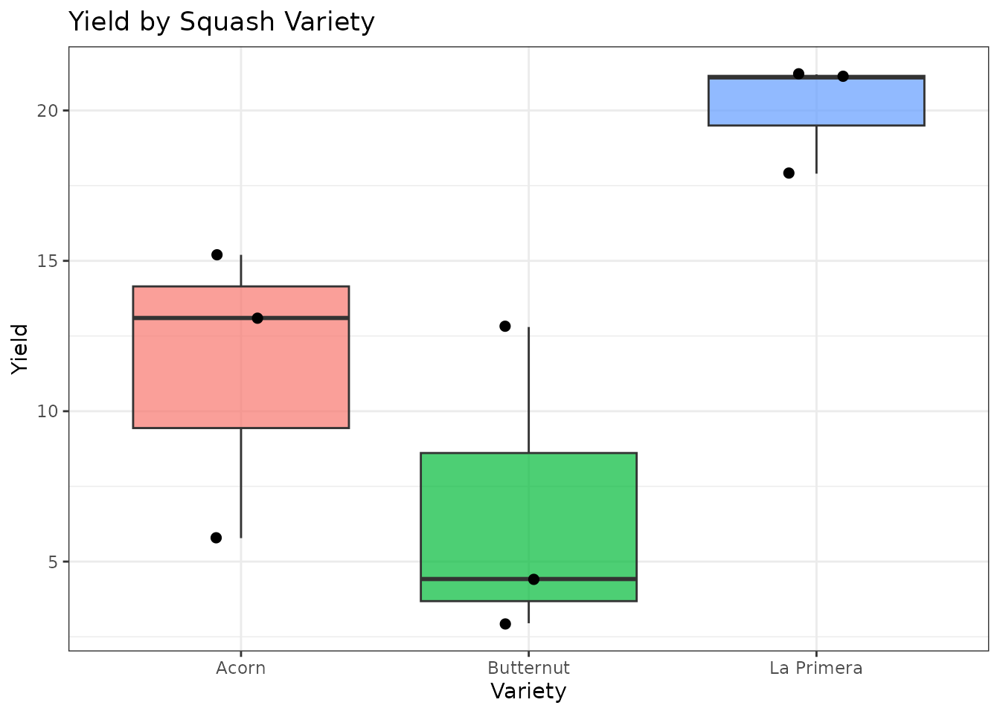
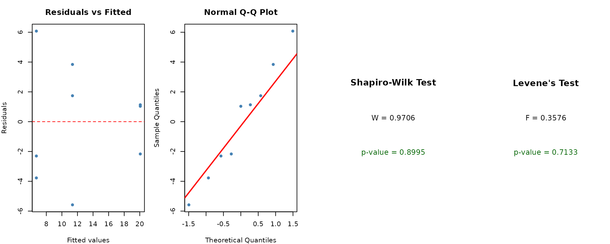
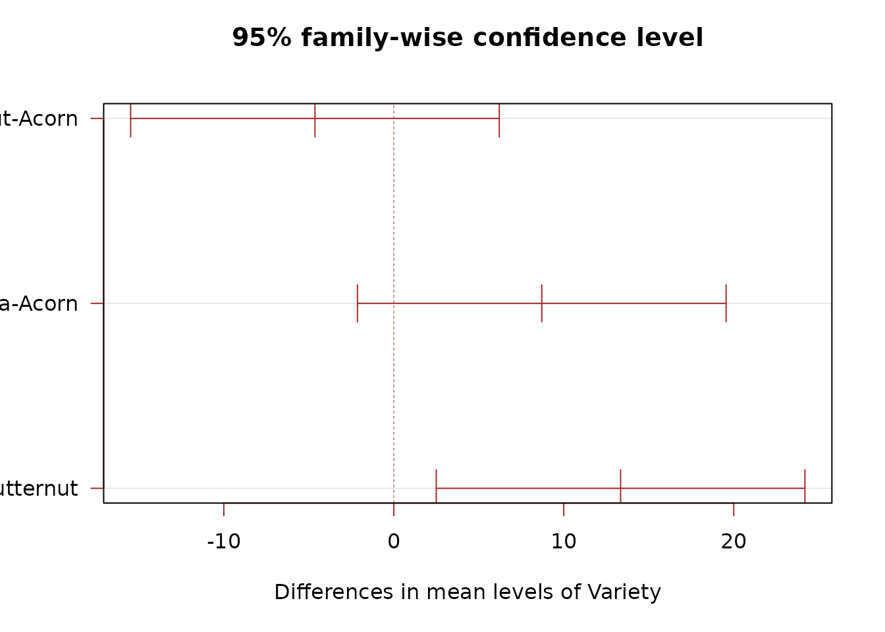
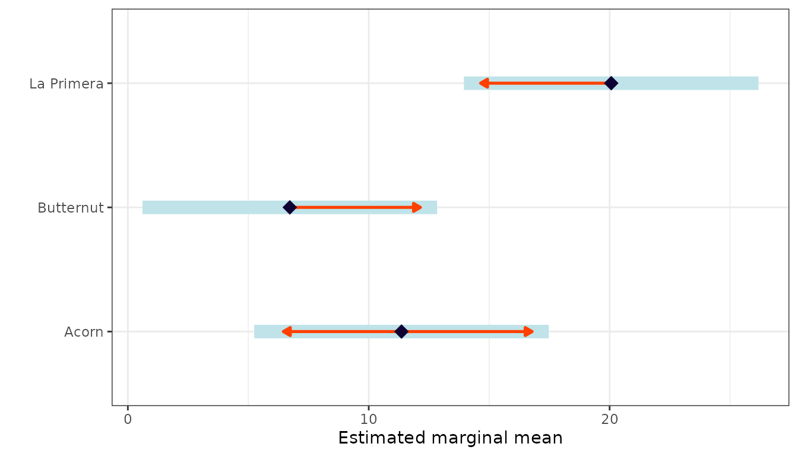

# Completely Randomized Design (CRD)

## When to Use

The **Completely Randomized Design (CRD)** is the simplest experimental
design. Use it when:

- There is **one treatment factor** with two or more levels.
- Experimental units are **homogeneous** (no known sources of
  variability to block).
- Treatments are **randomly assigned** to units without restriction.

CRD is common in laboratory experiments and greenhouse trials where
environmental conditions are uniform.

## The Design

In a CRD, each treatment is assigned to experimental units purely at
random. The statistical model is:

$$Y_{ij} = \mu + \tau_{i} + \varepsilon_{ij}$$

where $\mu$ is the overall mean, $\tau_{i}$ is the effect of treatment
$i$, and $\varepsilon_{ij} \sim N\left( 0,\sigma^{2} \right)$.

## Data

We use a dataset comparing the yield of three squash varieties (Acorn,
Butternut, Spaghetti) with three replicates each.

``` r
library(agrideshr)
data(crd_data)
str(crd_data)
#> Classes 'tbl_df', 'tbl' and 'data.frame':    9 obs. of  3 variables:
#>  $ Variety  : Factor w/ 3 levels "Acorn","Butternut",..: 3 3 3 2 2 2 1 1 1
#>  $ Replicate: Factor w/ 3 levels "rep1","rep2",..: 1 2 3 1 2 3 1 2 3
#>  $ Yield    : num  21.1 17.9 21.2 4.42 2.95 12.8 15.2 5.78 13.1
crd_data
#>      Variety Replicate Yield
#> 1 La Primera      rep1 21.10
#> 2 La Primera      rep2 17.90
#> 3 La Primera      rep3 21.20
#> 4  Butternut      rep1  4.42
#> 5  Butternut      rep2  2.95
#> 6  Butternut      rep3 12.80
#> 7      Acorn      rep1 15.20
#> 8      Acorn      rep2  5.78
#> 9      Acorn      rep3 13.10
```

## Exploratory Visualization

``` r
library(ggplot2)

ggplot(crd_data, aes(x = Variety, y = Yield, fill = Variety)) +
  geom_boxplot(alpha = 0.7, outlier.shape = 16) +
  geom_jitter(width = 0.1, size = 2) +
  theme_bw() +
  labs(title = "Yield by Squash Variety", y = "Yield", x = "Variety") +
  theme(legend.position = "none")
```



Descriptive statistics by variety:

``` r
library(dplyr)

crd_data %>%
  group_by(Variety) %>%
  summarise(
    N = n(),
    Mean = mean(Yield),
    SD = sd(Yield),
    .groups = "drop"
  )
#> # A tibble: 3 × 4
#>   Variety        N  Mean    SD
#>   <fct>      <int> <dbl> <dbl>
#> 1 Acorn          3 11.4   4.95
#> 2 Butternut      3  6.72  5.31
#> 3 La Primera     3 20.1   1.88
```

## Model Fitting

We fit a one-way ANOVA using
[`aov()`](https://rdrr.io/r/stats/aov.html):

``` r
mod <- aov(Yield ~ Variety, data = crd_data)
summary(mod)
#>             Df Sum Sq Mean Sq F value Pr(>F)  
#> Variety      2  275.4  137.67   7.348 0.0244 *
#> Residuals    6  112.4   18.74                 
#> ---
#> Signif. codes:  0 '***' 0.001 '**' 0.01 '*' 0.05 '.' 0.1 ' ' 1
```

The F-test assesses whether at least one variety mean differs from the
others.

## Assumption Checking

ANOVA assumes that residuals are normally distributed and that variances
are homogeneous across groups.

``` r
check_assumptions(mod, data = crd_data, group = "Variety")
```



We can also check normality per group:

``` r
crd_data %>%
  group_by(Variety) %>%
  summarise(
    Shapiro_p = shapiro.test(Yield)$p.value,
    .groups = "drop"
  )
#> # A tibble: 3 × 2
#>   Variety    Shapiro_p
#>   <fct>          <dbl>
#> 1 Acorn         0.409 
#> 2 Butternut     0.265 
#> 3 La Primera    0.0509
```

## Post-hoc Comparisons

If the F-test is significant, we compare varieties pairwise using
Tukey’s HSD:

``` r
TukeyHSD(mod)
#>   Tukey multiple comparisons of means
#>     95% family-wise confidence level
#> 
#> Fit: aov(formula = Yield ~ Variety, data = crd_data)
#> 
#> $Variety
#>                           diff        lwr       upr     p adj
#> Butternut-Acorn      -4.636667 -15.481064  6.207731 0.4396163
#> La Primera-Acorn      8.706667  -2.137731 19.551064 0.1069483
#> La Primera-Butternut 13.343333   2.498936 24.187731 0.0215689
```

``` r
plot(TukeyHSD(mod), las = 1, col = "brown")
```



### Estimated Marginal Means

The `emmeans` package provides estimated marginal means and pairwise
contrasts:

``` r
library(emmeans)

emm <- emmeans(mod, specs = "Variety")
emm
#>  Variety    emmean  SE df lower.CL upper.CL
#>  Acorn       11.36 2.5  6    5.245     17.5
#>  Butternut    6.72 2.5  6    0.608     12.8
#>  La Primera  20.07 2.5  6   13.951     26.2
#> 
#> Confidence level used: 0.95
```

``` r
pairs(emm)
#>  contrast               estimate   SE df t.ratio p.value
#>  Acorn - Butternut          4.64 3.53  6   1.312  0.4396
#>  Acorn - La Primera        -8.71 3.53  6  -2.463  0.1069
#>  Butternut - La Primera   -13.34 3.53  6  -3.775  0.0216
#> 
#> P value adjustment: tukey method for comparing a family of 3 estimates
```

``` r
plot(emm, comparisons = TRUE) +
  theme_bw() +
  labs(y = "", x = "Estimated marginal mean")
```



## Conclusion

The CRD analysis provides a straightforward way to compare treatment
means when experimental units are homogeneous. The key outputs are:

1.  **F-test** from the ANOVA table to detect overall differences.
2.  **Diagnostic plots** to verify model assumptions.
3.  **Tukey HSD** or **emmeans** contrasts for pairwise comparisons.

When experimental units are not homogeneous, consider using a
[Randomized Complete Block
Design](https://emantzoo.github.io/agrideshr/articles/02-rcbd.md)
instead.
