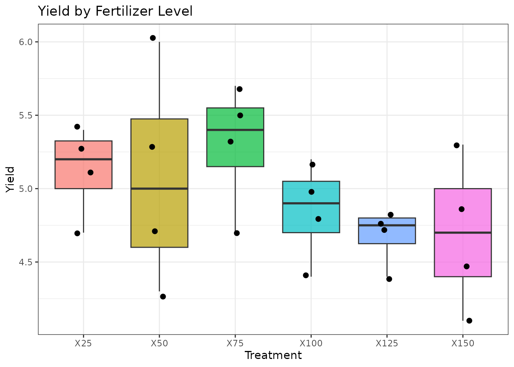
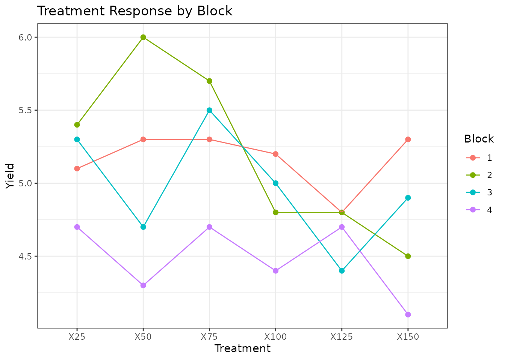
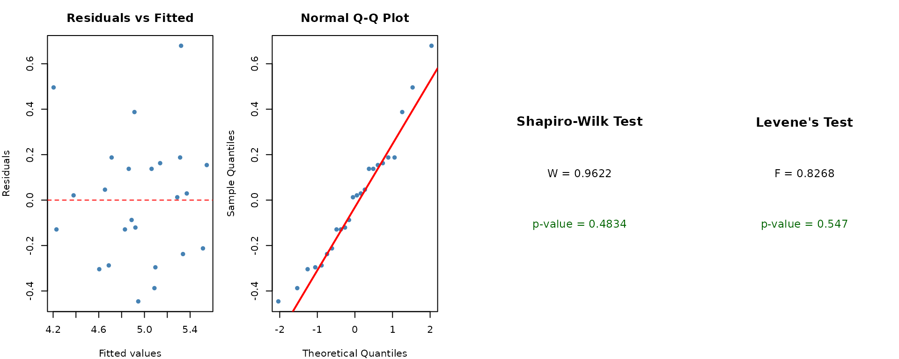
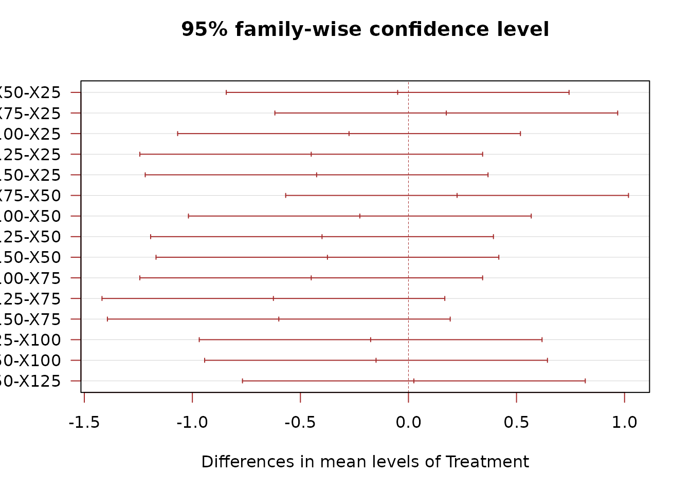
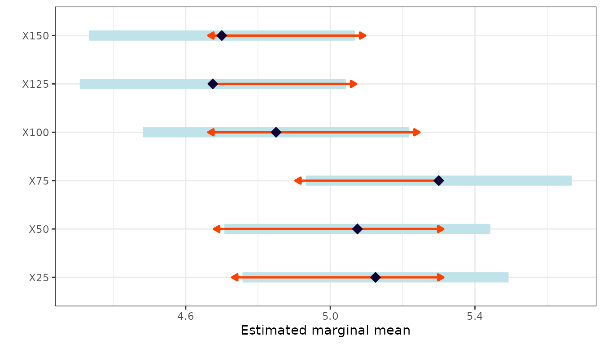
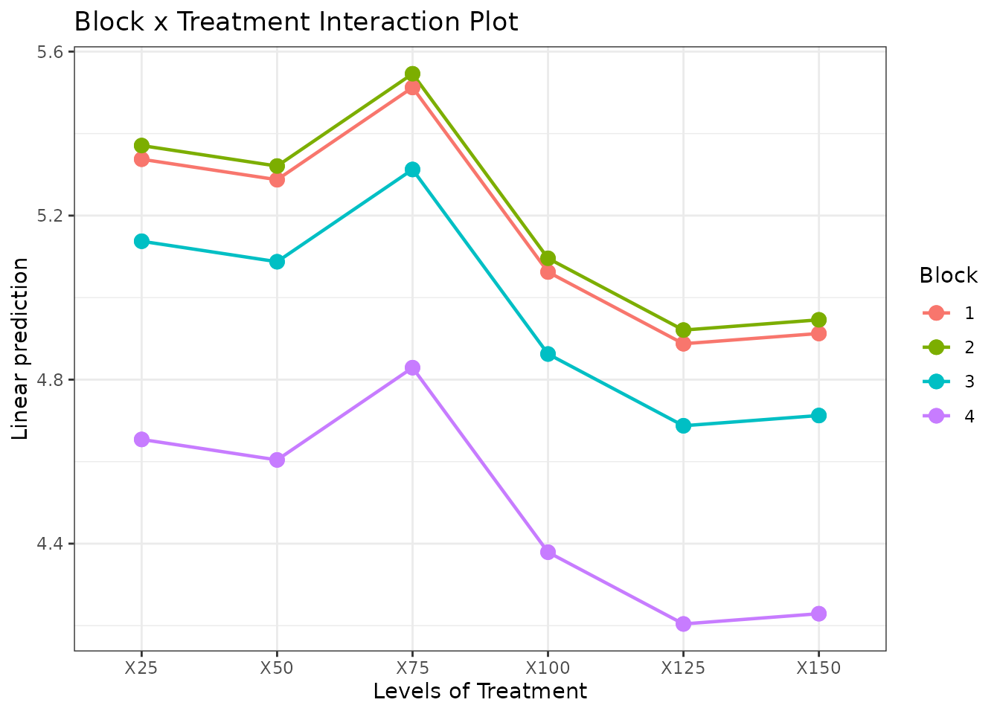

# Randomized Complete Block Design (RCBD)

## When to Use

The **Randomized Complete Block Design (RCBD)** is used when:

- There is **one treatment factor** of interest.
- There is a **known source of variability** (e.g., soil gradient, time,
  lab bench) that can be controlled by grouping units into **blocks**.
- Each block contains **all treatments** exactly once.

RCBD reduces experimental error by accounting for block-to-block
variability, making it more efficient than a CRD when conditions are not
uniform.

## The Design

The statistical model is:

$$Y_{ij} = \mu + \beta_{j} + \tau_{i} + \varepsilon_{ij}$$

where $\beta_{j}$ is the effect of block $j$ and $\tau_{i}$ is the
treatment effect. Block effects are included to absorb known
variability, but we are primarily interested in testing treatment
differences.

## Data

We use a dataset with six fertilizer levels (X25 through X150) applied
across four blocks.

``` r
library(agrideshr)
data(rcbd_data)
str(rcbd_data)
#> Classes 'tbl_df', 'tbl' and 'data.frame':    24 obs. of  3 variables:
#>  $ Block    : Factor w/ 4 levels "1","2","3","4": 1 1 1 1 1 1 2 2 2 2 ...
#>  $ Treatment: Factor w/ 6 levels "X25","X50","X75",..: 1 2 3 4 5 6 1 2 3 4 ...
#>  $ Yield    : num  5.1 5.3 5.3 5.2 4.8 5.3 5.4 6 5.7 4.8 ...
head(rcbd_data, 12)
#>    Block Treatment Yield
#> 1      1       X25   5.1
#> 2      1       X50   5.3
#> 3      1       X75   5.3
#> 4      1      X100   5.2
#> 5      1      X125   4.8
#> 6      1      X150   5.3
#> 7      2       X25   5.4
#> 8      2       X50   6.0
#> 9      2       X75   5.7
#> 10     2      X100   4.8
#> 11     2      X125   4.8
#> 12     2      X150   4.5
```

## Exploratory Visualization

``` r
library(ggplot2)

ggplot(rcbd_data, aes(x = Treatment, y = Yield, fill = Treatment)) +
  geom_boxplot(alpha = 0.7) +
  geom_jitter(width = 0.1, size = 2) +
  theme_bw() +
  labs(title = "Yield by Fertilizer Level", y = "Yield") +
  theme(legend.position = "none")
```



Treatment response by block:

``` r
ggplot(rcbd_data, aes(x = Treatment, y = Yield, colour = Block, group = Block)) +
  geom_point(size = 2) +
  stat_summary(fun = mean, geom = "line") +
  theme_bw() +
  labs(title = "Treatment Response by Block")
```



## Model Fitting

In RCBD, the block is included as a factor in the model but is not the
focus of inference:

``` r
mod <- aov(Yield ~ Block + Treatment, data = rcbd_data)
summary(mod)
#>             Df Sum Sq Mean Sq F value  Pr(>F)   
#> Block        3  1.965  0.6549   5.494 0.00949 **
#> Treatment    5  1.267  0.2534   2.126 0.11837   
#> Residuals   15  1.788  0.1192                   
#> ---
#> Signif. codes:  0 '***' 0.001 '**' 0.01 '*' 0.05 '.' 0.1 ' ' 1
```

The F-test for `Treatment` tells us whether fertilizer levels differ
after accounting for block effects.

## Assumption Checking

``` r
check_assumptions(mod, data = rcbd_data, group = "Treatment")
```



## Post-hoc Comparisons

We compare treatments (not blocks) using Tukey’s HSD:

``` r
TukeyHSD(mod, which = "Treatment")
#>   Tukey multiple comparisons of means
#>     95% family-wise confidence level
#> 
#> Fit: aov(formula = Yield ~ Block + Treatment, data = rcbd_data)
#> 
#> $Treatment
#>             diff        lwr       upr     p adj
#> X50-X25   -0.050 -0.8431557 0.7431557 0.9999384
#> X75-X25    0.175 -0.6181557 0.9681557 0.9768219
#> X100-X25  -0.275 -1.0681557 0.5181557 0.8629753
#> X125-X25  -0.450 -1.2431557 0.3431557 0.4697141
#> X150-X25  -0.425 -1.2181557 0.3681557 0.5279646
#> X75-X50    0.225 -0.5681557 1.0181557 0.9347621
#> X100-X50  -0.225 -1.0181557 0.5681557 0.9347621
#> X125-X50  -0.400 -1.1931557 0.3931557 0.5879468
#> X150-X50  -0.375 -1.1681557 0.4181557 0.6483439
#> X100-X75  -0.450 -1.2431557 0.3431557 0.4697141
#> X125-X75  -0.625 -1.4181557 0.1681557 0.1678730
#> X150-X75  -0.600 -1.3931557 0.1931557 0.1980689
#> X125-X100 -0.175 -0.9681557 0.6181557 0.9768219
#> X150-X100 -0.150 -0.9431557 0.6431557 0.9882241
#> X150-X125  0.025 -0.7681557 0.8181557 0.9999980
```

``` r
plot(TukeyHSD(mod, which = "Treatment"), las = 1, col = "brown")
```



### Estimated Marginal Means

``` r
library(emmeans)

emm <- emmeans(mod, specs = "Treatment")
emm
#>  Treatment emmean    SE df lower.CL upper.CL
#>  X25         5.12 0.173 15     4.76     5.49
#>  X50         5.08 0.173 15     4.71     5.44
#>  X75         5.30 0.173 15     4.93     5.67
#>  X100        4.85 0.173 15     4.48     5.22
#>  X125        4.67 0.173 15     4.31     5.04
#>  X150        4.70 0.173 15     4.33     5.07
#> 
#> Results are averaged over the levels of: Block 
#> Confidence level used: 0.95
```

``` r
pairs(emm)
#>  contrast    estimate    SE df t.ratio p.value
#>  X25 - X50      0.050 0.244 15   0.205  0.9999
#>  X25 - X75     -0.175 0.244 15  -0.717  0.9768
#>  X25 - X100     0.275 0.244 15   1.126  0.8630
#>  X25 - X125     0.450 0.244 15   1.843  0.4697
#>  X25 - X150     0.425 0.244 15   1.741  0.5280
#>  X50 - X75     -0.225 0.244 15  -0.922  0.9348
#>  X50 - X100     0.225 0.244 15   0.922  0.9348
#>  X50 - X125     0.400 0.244 15   1.639  0.5879
#>  X50 - X150     0.375 0.244 15   1.536  0.6483
#>  X75 - X100     0.450 0.244 15   1.843  0.4697
#>  X75 - X125     0.625 0.244 15   2.560  0.1679
#>  X75 - X150     0.600 0.244 15   2.458  0.1981
#>  X100 - X125    0.175 0.244 15   0.717  0.9768
#>  X100 - X150    0.150 0.244 15   0.614  0.9882
#>  X125 - X150   -0.025 0.244 15  -0.102  1.0000
#> 
#> Results are averaged over the levels of: Block 
#> P value adjustment: tukey method for comparing a family of 6 estimates
```

``` r
plot(emm, comparisons = TRUE) +
  theme_bw() +
  labs(y = "", x = "Estimated marginal mean")
```



### Block-by-Treatment Interaction Plot

This plot helps visualise whether the treatment effect is consistent
across blocks:

``` r
emmip(mod, Block ~ Treatment) +
  theme_bw() +
  labs(title = "Block x Treatment Interaction Plot")
```



## Conclusion

The RCBD is the workhorse of agricultural experimentation. By blocking
on a known source of variability, it provides a more precise estimate of
treatment effects than a CRD. Key outputs:

1.  **ANOVA table** with block and treatment effects separated.
2.  **Tukey HSD** for pairwise treatment comparisons.
3.  **EMM interaction plots** to check consistency across blocks.

When there are **two sources of heterogeneity** (e.g., rows and
columns), consider a [Latin Square
Design](https://emantzoo.github.io/agrideshr/articles/03-latin-square.md).
