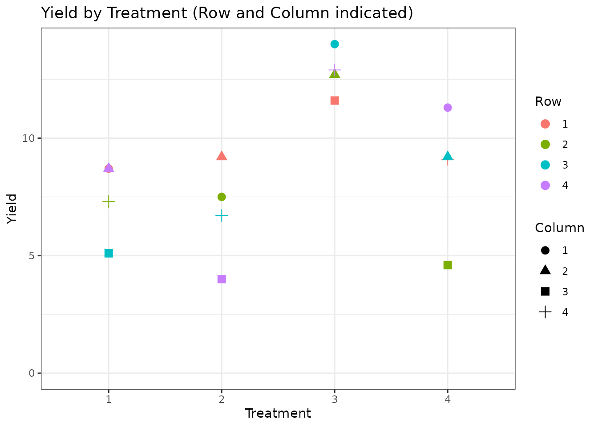
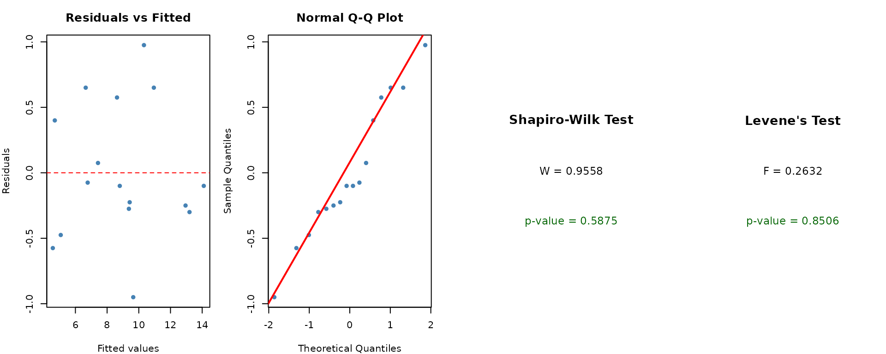
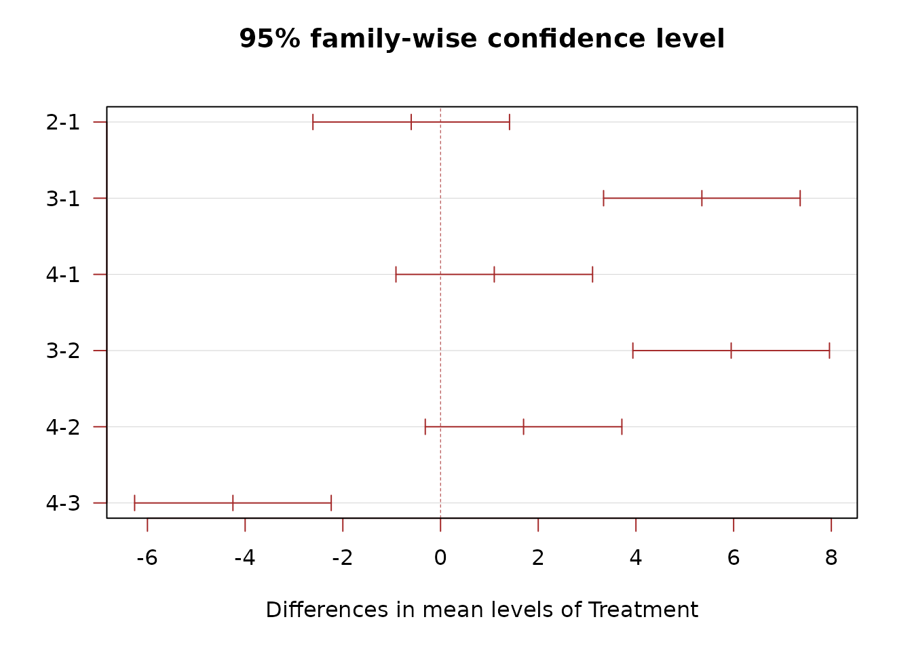
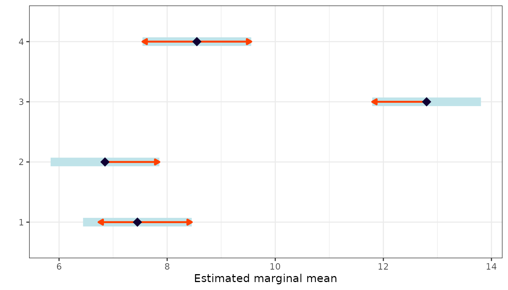
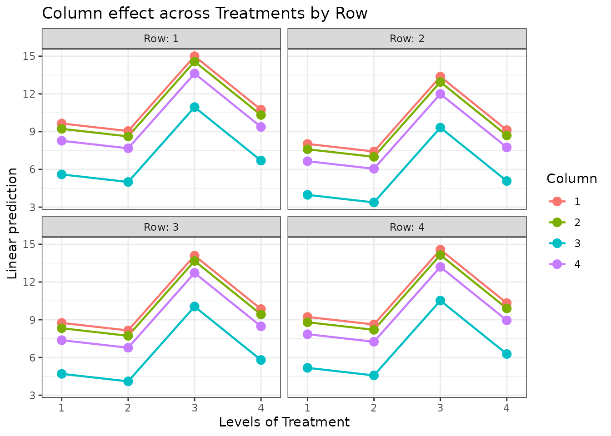
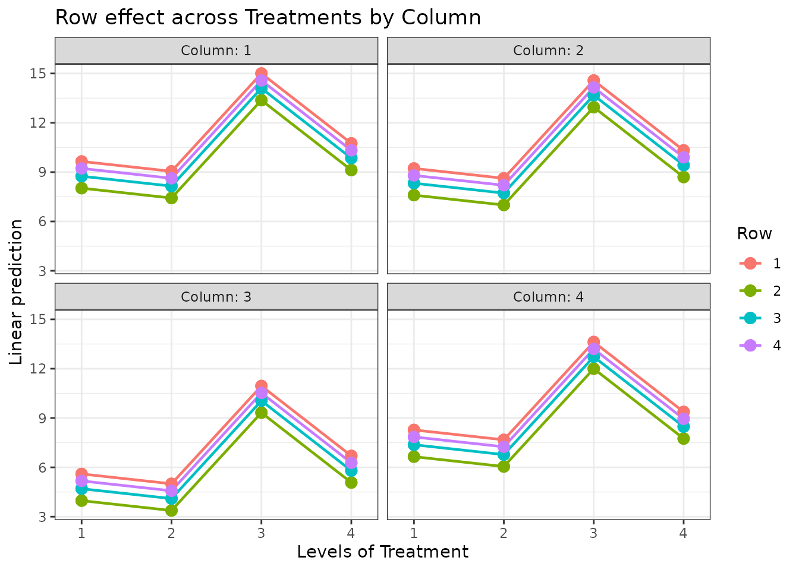

# Latin Square Design

## When to Use

The **Latin Square Design (LSD)** extends the RCBD by controlling for
**two sources of variability** simultaneously. Use it when:

- You have **one treatment factor** of interest.
- There are **two blocking factors** (e.g., rows and columns in a field,
  days and operators in a lab).
- The number of treatments equals the number of levels in each blocking
  factor (producing a square layout).

## The Design

Each treatment appears exactly once in every row and every column. The
model is:

$$Y_{ijk} = \mu + \rho_{i} + \gamma_{j} + \tau_{k} + \varepsilon_{ijk}$$

where $\rho_{i}$ is the row effect, $\gamma_{j}$ is the column effect,
and $\tau_{k}$ is the treatment effect.

## Data

We use a 4x4 Latin square dataset with four treatments, four rows, and
four columns.

``` r
library(agrideshr)
data(lsd_data)
str(lsd_data)
#> Classes 'tbl_df', 'tbl' and 'data.frame':    16 obs. of  4 variables:
#>  $ Row      : Factor w/ 4 levels "1","2","3","4": 1 2 3 4 1 2 3 4 1 2 ...
#>  $ Column   : Factor w/ 4 levels "1","2","3","4": 1 4 3 2 2 1 4 3 3 2 ...
#>  $ Treatment: Factor w/ 4 levels "1","2","3","4": 1 1 1 1 2 2 2 2 3 3 ...
#>  $ Yield    : num  8.7 7.3 5.1 8.7 9.2 7.5 6.7 4 11.6 12.7 ...
lsd_data
#>    Row Column Treatment Yield
#> 1    1      1         1   8.7
#> 2    2      4         1   7.3
#> 3    3      3         1   5.1
#> 4    4      2         1   8.7
#> 5    1      2         2   9.2
#> 6    2      1         2   7.5
#> 7    3      4         2   6.7
#> 8    4      3         2   4.0
#> 9    1      3         3  11.6
#> 10   2      2         3  12.7
#> 11   3      1         3  14.0
#> 12   4      4         3  12.9
#> 13   1      4         4   9.1
#> 14   2      3         4   4.6
#> 15   3      2         4   9.2
#> 16   4      1         4  11.3
```

## Exploratory Visualization

``` r
library(ggplot2)

ggplot(lsd_data, aes(x = Treatment, y = Yield, colour = Row, shape = Column)) +
  geom_point(size = 3) +
  ylim(0, NA) +
  theme_bw() +
  labs(title = "Yield by Treatment (Row and Column indicated)")
```



## Model Fitting

Both row and column effects are included in the model:

``` r
mod <- aov(Yield ~ Row + Column + Treatment, data = lsd_data)
summary(mod)
#>             Df Sum Sq Mean Sq F value   Pr(>F)    
#> Row          3   5.82   1.941   2.872 0.125712    
#> Column       3  39.67  13.224  19.567 0.001683 ** 
#> Treatment    3  86.55  28.849  42.687 0.000193 ***
#> Residuals    6   4.06   0.676                     
#> ---
#> Signif. codes:  0 '***' 0.001 '**' 0.01 '*' 0.05 '.' 0.1 ' ' 1
```

The F-test for `Treatment` assesses treatment differences after removing
row and column variability.

## Assumption Checking

``` r
check_assumptions(mod, data = lsd_data, group = "Treatment")
```



## Post-hoc Comparisons

We compare treatments only (rows and columns are nuisance factors):

``` r
TukeyHSD(mod, which = "Treatment")
#>   Tukey multiple comparisons of means
#>     95% family-wise confidence level
#> 
#> Fit: aov(formula = Yield ~ Row + Column + Treatment, data = lsd_data)
#> 
#> $Treatment
#>      diff        lwr       upr     p adj
#> 2-1 -0.60 -2.6123136  1.412314 0.7386088
#> 3-1  5.35  3.3376864  7.362314 0.0003869
#> 4-1  1.10 -0.9123136  3.112314 0.3224865
#> 3-2  5.95  3.9376864  7.962314 0.0002124
#> 4-2  1.70 -0.3123136  3.712314 0.0941779
#> 4-3 -4.25 -6.2623136 -2.237686 0.0013761
```

``` r
plot(TukeyHSD(mod, which = "Treatment"), las = 1, col = "brown")
```



### Estimated Marginal Means

``` r
library(emmeans)

emm <- emmeans(mod, specs = "Treatment")
emm
#>  Treatment emmean    SE df lower.CL upper.CL
#>  1           7.45 0.411  6     6.44     8.46
#>  2           6.85 0.411  6     5.84     7.86
#>  3          12.80 0.411  6    11.79    13.81
#>  4           8.55 0.411  6     7.54     9.56
#> 
#> Results are averaged over the levels of: Row, Column 
#> Confidence level used: 0.95
```

``` r
pairs(emm)
#>  contrast                estimate    SE df t.ratio p.value
#>  Treatment1 - Treatment2     0.60 0.581  6   1.032  0.7386
#>  Treatment1 - Treatment3    -5.35 0.581  6  -9.203  0.0004
#>  Treatment1 - Treatment4    -1.10 0.581  6  -1.892  0.3225
#>  Treatment2 - Treatment3    -5.95 0.581  6 -10.236  0.0002
#>  Treatment2 - Treatment4    -1.70 0.581  6  -2.924  0.0942
#>  Treatment3 - Treatment4     4.25 0.581  6   7.311  0.0014
#> 
#> Results are averaged over the levels of: Row, Column 
#> P value adjustment: tukey method for comparing a family of 4 estimates
```

``` r
plot(emm, comparisons = TRUE) +
  theme_bw() +
  labs(y = "", x = "Estimated marginal mean")
```



### Interaction Plots

Visualise treatment effects across rows and columns:

``` r
emmip(mod, Column ~ Treatment | Row) +
  theme_bw() +
  labs(title = "Column effect across Treatments by Row")
```



``` r
emmip(mod, Row ~ Treatment | Column) +
  theme_bw() +
  labs(title = "Row effect across Treatments by Column")
```



## Conclusion

The Latin Square Design controls for two sources of heterogeneity
simultaneously, making it highly efficient when the experimental layout
naturally forms a grid. Limitations include:

- The number of treatments must equal the number of row and column
  levels.
- No interaction terms can be estimated (df are used for blocking).

When you need to study **two treatment factors** and their interaction,
consider a [Factorial
Design](https://emantzoo.github.io/agrideshr/articles/04-factorial.md).
