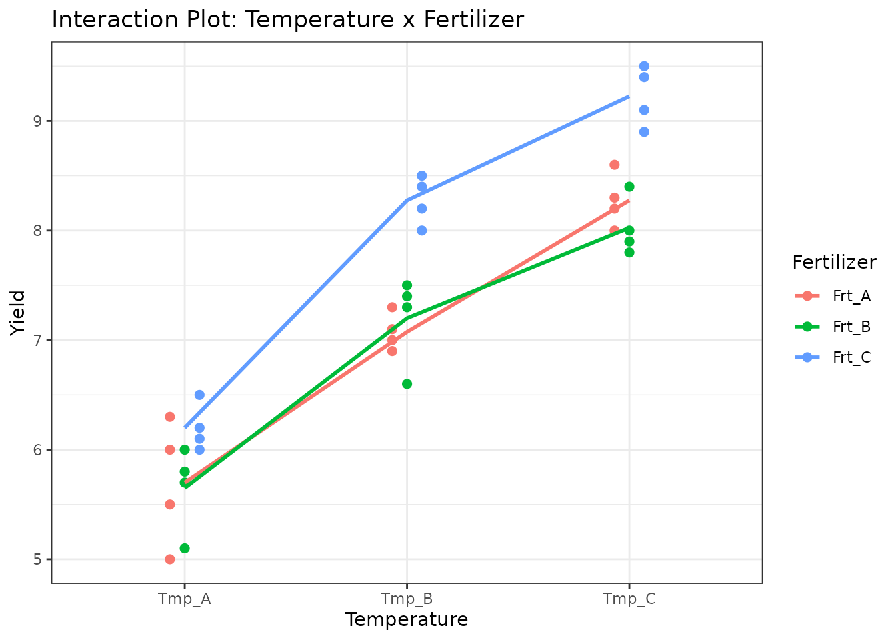
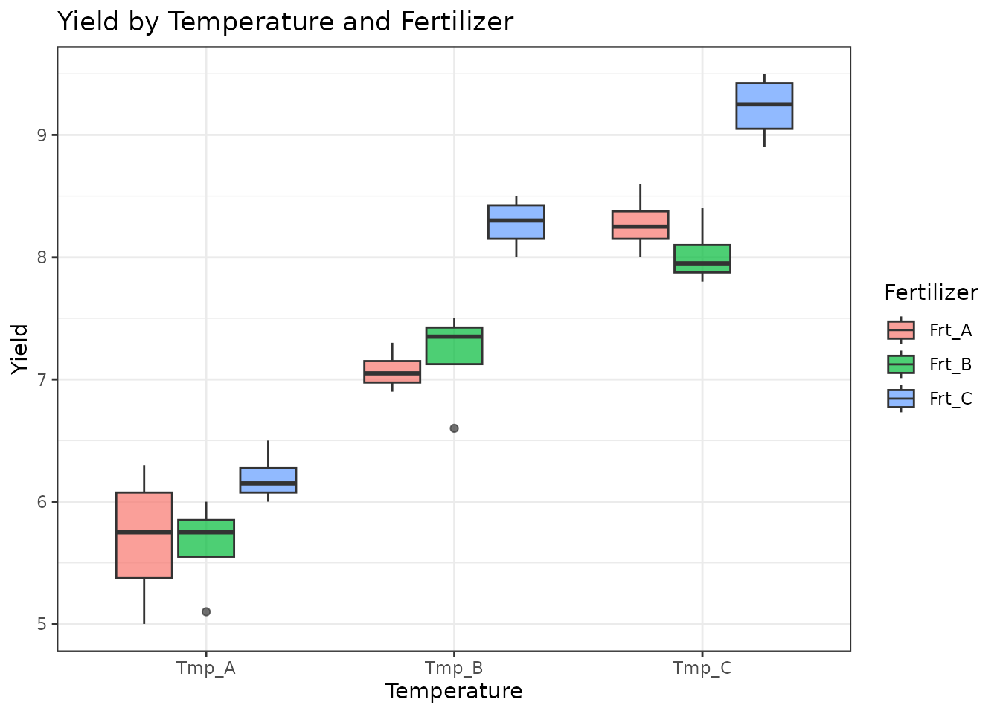
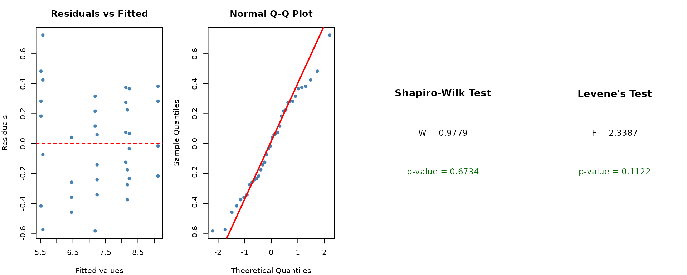
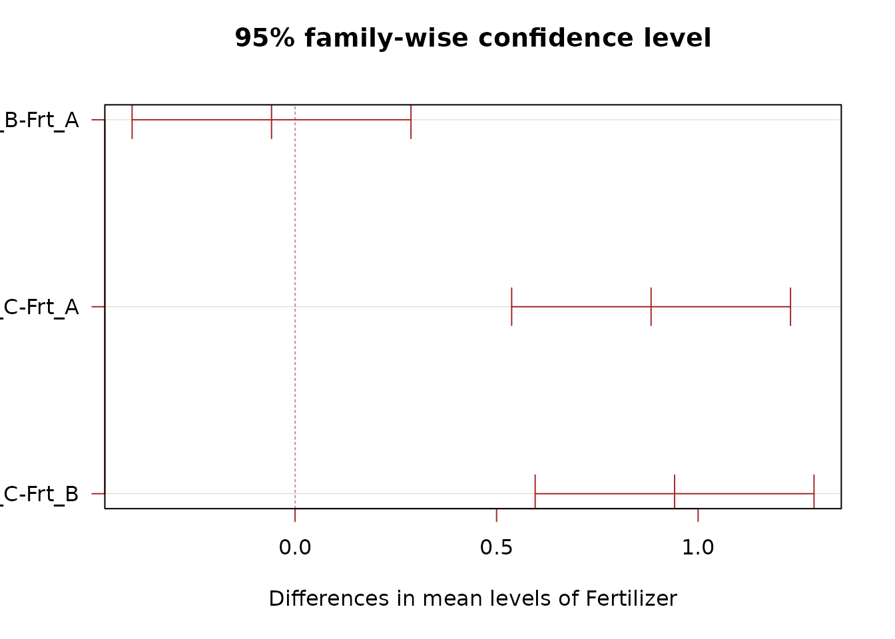
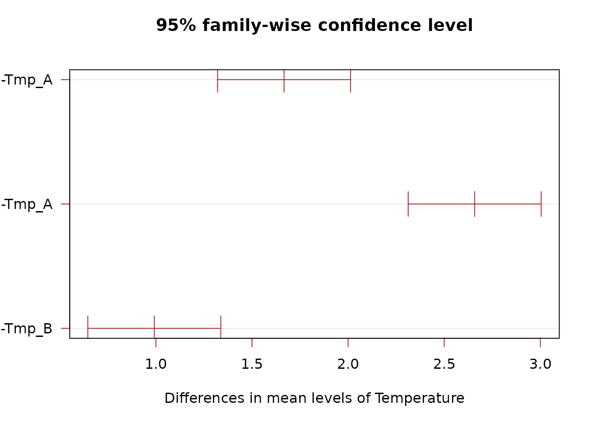
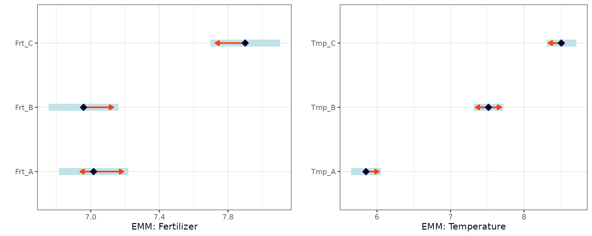
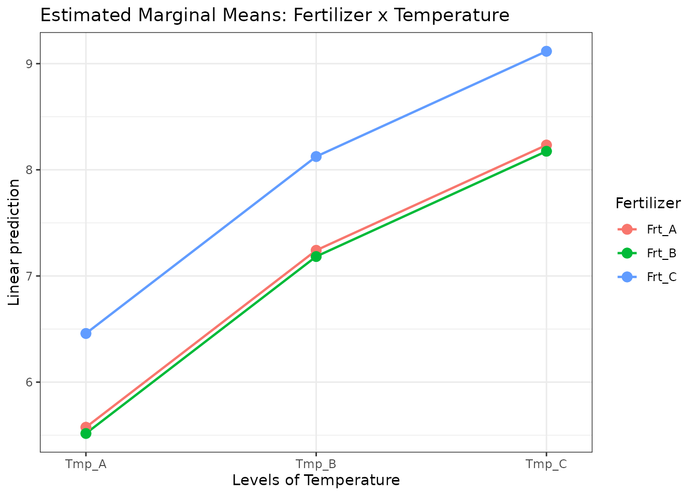

# Factorial Design (Two-Way ANOVA)

## When to Use

A **Factorial Design** is used when:

- You want to study **two or more treatment factors** simultaneously.
- You are interested in both **main effects** and **interactions**
  between factors.
- All combinations of factor levels are tested.

Factorial designs are more efficient than running separate one-factor
experiments because they provide information about interactions at no
extra cost.

## The Design

For a two-factor factorial, the model is:

$$Y_{ijk} = \mu + \alpha_{i} + \beta_{j} + (\alpha\beta)_{ij} + \varepsilon_{ijk}$$

where $\alpha_{i}$ is the effect of factor A (e.g., Temperature),
$\beta_{j}$ is the effect of factor B (e.g., Fertilizer), and
$(\alpha\beta)_{ij}$ is their interaction.

## Data

We use a dataset crossing three temperature levels with three fertilizer
types, with four replicates per combination.

``` r
library(agrideshr)
data(factorial_data)
str(factorial_data)
#> Classes 'tbl_df', 'tbl' and 'data.frame':    36 obs. of  3 variables:
#>  $ Temperature: Factor w/ 3 levels "Tmp_A","Tmp_B",..: 1 1 1 1 1 1 1 1 1 1 ...
#>  $ Fertilizer : Factor w/ 3 levels "Frt_A","Frt_B",..: 1 2 3 1 2 3 1 2 3 1 ...
#>  $ Yield      : num  5 5.1 6 6 5.8 6.1 6.3 6 6.2 5.5 ...
head(factorial_data, 12)
#>    Temperature Fertilizer Yield
#> 1        Tmp_A      Frt_A   5.0
#> 2        Tmp_A      Frt_B   5.1
#> 3        Tmp_A      Frt_C   6.0
#> 4        Tmp_A      Frt_A   6.0
#> 5        Tmp_A      Frt_B   5.8
#> 6        Tmp_A      Frt_C   6.1
#> 7        Tmp_A      Frt_A   6.3
#> 8        Tmp_A      Frt_B   6.0
#> 9        Tmp_A      Frt_C   6.2
#> 10       Tmp_A      Frt_A   5.5
#> 11       Tmp_A      Frt_B   5.7
#> 12       Tmp_A      Frt_C   6.5
```

## Exploratory Visualization

``` r
library(ggplot2)

ggplot(factorial_data, aes(x = Temperature, y = Yield, colour = Fertilizer,
                            group = Fertilizer)) +
  geom_point(size = 2, position = position_dodge(0.2)) +
  stat_summary(fun = mean, geom = "line", linewidth = 1) +
  theme_bw() +
  labs(title = "Interaction Plot: Temperature x Fertilizer")
```



``` r
ggplot(factorial_data, aes(x = Temperature, y = Yield, fill = Fertilizer)) +
  geom_boxplot(alpha = 0.7) +
  theme_bw() +
  labs(title = "Yield by Temperature and Fertilizer")
```



## Model Fitting

### Additive Model (No Interaction)

``` r
mod_add <- aov(Yield ~ Temperature + Fertilizer, data = factorial_data)
summary(mod_add)
#>             Df Sum Sq Mean Sq F value   Pr(>F)    
#> Temperature  2  43.31  21.656  182.72  < 2e-16 ***
#> Fertilizer   2   6.68   3.341   28.19 1.06e-07 ***
#> Residuals   31   3.67   0.119                     
#> ---
#> Signif. codes:  0 '***' 0.001 '**' 0.01 '*' 0.05 '.' 0.1 ' ' 1
```

### Full Model (With Interaction)

``` r
mod_full <- aov(Yield ~ Temperature * Fertilizer, data = factorial_data)
summary(mod_full)
#>                        Df Sum Sq Mean Sq F value   Pr(>F)    
#> Temperature             2  43.31  21.656 199.729  < 2e-16 ***
#> Fertilizer              2   6.68   3.341  30.812 1.08e-07 ***
#> Temperature:Fertilizer  4   0.75   0.187   1.722    0.174    
#> Residuals              27   2.93   0.108                     
#> ---
#> Signif. codes:  0 '***' 0.001 '**' 0.01 '*' 0.05 '.' 0.1 ' ' 1
```

If the interaction term is not significant, the additive model is
preferred for its simplicity. If significant, the interaction must be
interpreted.

## Assumption Checking

``` r
check_assumptions(mod_add, data = factorial_data, group = "Temperature")
```



## Post-hoc Comparisons

### By Fertilizer

``` r
TukeyHSD(mod_add, which = "Fertilizer")
#>   Tukey multiple comparisons of means
#>     95% family-wise confidence level
#> 
#> Fit: aov(formula = Yield ~ Temperature + Fertilizer, data = factorial_data)
#> 
#> $Fertilizer
#>                    diff        lwr       upr     p adj
#> Frt_B-Frt_A -0.05833333 -0.4042471 0.2875805 0.9096944
#> Frt_C-Frt_A  0.88333333  0.5374195 1.2292471 0.0000016
#> Frt_C-Frt_B  0.94166667  0.5957529 1.2875805 0.0000005
```

``` r
plot(TukeyHSD(mod_add, which = "Fertilizer"), las = 1, col = "brown")
```



### By Temperature

``` r
TukeyHSD(mod_add, which = "Temperature")
#>   Tukey multiple comparisons of means
#>     95% family-wise confidence level
#> 
#> Fit: aov(formula = Yield ~ Temperature + Fertilizer, data = factorial_data)
#> 
#> $Temperature
#>                  diff       lwr      upr p adj
#> Tmp_B-Tmp_A 1.6666667 1.3207529 2.012580 0e+00
#> Tmp_C-Tmp_A 2.6583333 2.3124195 3.004247 0e+00
#> Tmp_C-Tmp_B 0.9916667 0.6457529 1.337580 2e-07
```

``` r
plot(TukeyHSD(mod_add, which = "Temperature"), las = 1, col = "brown")
```



### Estimated Marginal Means

``` r
library(emmeans)

emm_fert <- emmeans(mod_add, specs = "Fertilizer")
emm_fert
#>  Fertilizer emmean     SE df lower.CL upper.CL
#>  Frt_A        7.02 0.0994 31     6.81     7.22
#>  Frt_B        6.96 0.0994 31     6.76     7.16
#>  Frt_C        7.90 0.0994 31     7.70     8.10
#> 
#> Results are averaged over the levels of: Temperature 
#> Confidence level used: 0.95
pairs(emm_fert)
#>  contrast      estimate    SE df t.ratio p.value
#>  Frt_A - Frt_B   0.0583 0.141 31   0.415  0.9097
#>  Frt_A - Frt_C  -0.8833 0.141 31  -6.285 <0.0001
#>  Frt_B - Frt_C  -0.9417 0.141 31  -6.700 <0.0001
#> 
#> Results are averaged over the levels of: Temperature 
#> P value adjustment: tukey method for comparing a family of 3 estimates
```

``` r
emm_temp <- emmeans(mod_add, specs = "Temperature")
emm_temp
#>  Temperature emmean     SE df lower.CL upper.CL
#>  Tmp_A         5.85 0.0994 31     5.65     6.05
#>  Tmp_B         7.52 0.0994 31     7.31     7.72
#>  Tmp_C         8.51 0.0994 31     8.31     8.71
#> 
#> Results are averaged over the levels of: Fertilizer 
#> Confidence level used: 0.95
pairs(emm_temp)
#>  contrast      estimate    SE df t.ratio p.value
#>  Tmp_A - Tmp_B   -1.667 0.141 31 -11.858 <0.0001
#>  Tmp_A - Tmp_C   -2.658 0.141 31 -18.914 <0.0001
#>  Tmp_B - Tmp_C   -0.992 0.141 31  -7.056 <0.0001
#> 
#> Results are averaged over the levels of: Fertilizer 
#> P value adjustment: tukey method for comparing a family of 3 estimates
```

``` r
p1 <- plot(emm_fert, comparisons = TRUE) +
  theme_bw() + labs(y = "", x = "EMM: Fertilizer")
p2 <- plot(emm_temp, comparisons = TRUE) +
  theme_bw() + labs(y = "", x = "EMM: Temperature")
gridExtra::grid.arrange(p1, p2, ncol = 2)
```



### Conditional Contrasts (If Interaction Is Present)

When the interaction is significant, compare one factor at each level of
the other:

``` r
# Temperature comparisons within each Fertilizer level
emmeans(mod_full, pairwise ~ Temperature | Fertilizer)

# Fertilizer comparisons within each Temperature level
emmeans(mod_full, pairwise ~ Fertilizer | Temperature)
```

### Interaction Plot (EMM)

``` r
emmip(mod_add, Fertilizer ~ Temperature) +
  theme_bw() +
  labs(title = "Estimated Marginal Means: Fertilizer x Temperature")
```



## Conclusion

Factorial designs allow efficient study of multiple factors and their
interactions. The analysis workflow:

1.  Fit both additive and interaction models.
2.  Test whether the interaction is significant.
3.  If **no interaction**: interpret main effects separately.
4.  If **interaction present**: use conditional contrasts to compare one
    factor within levels of the other.

When factors have a **nested structure** (e.g., sub-treatments applied
within main treatments), consider a [Split-Plot
Design](https://emantzoo.github.io/agrideshr/articles/05-split-plot.md).
