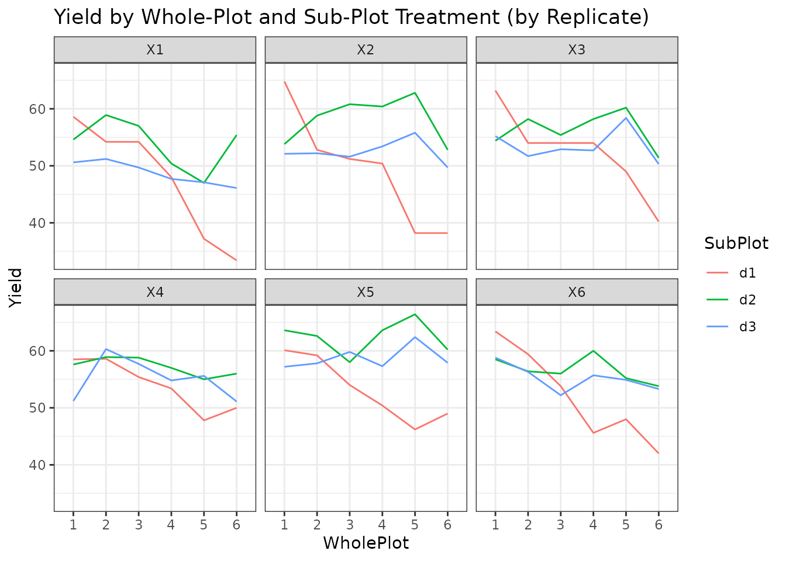
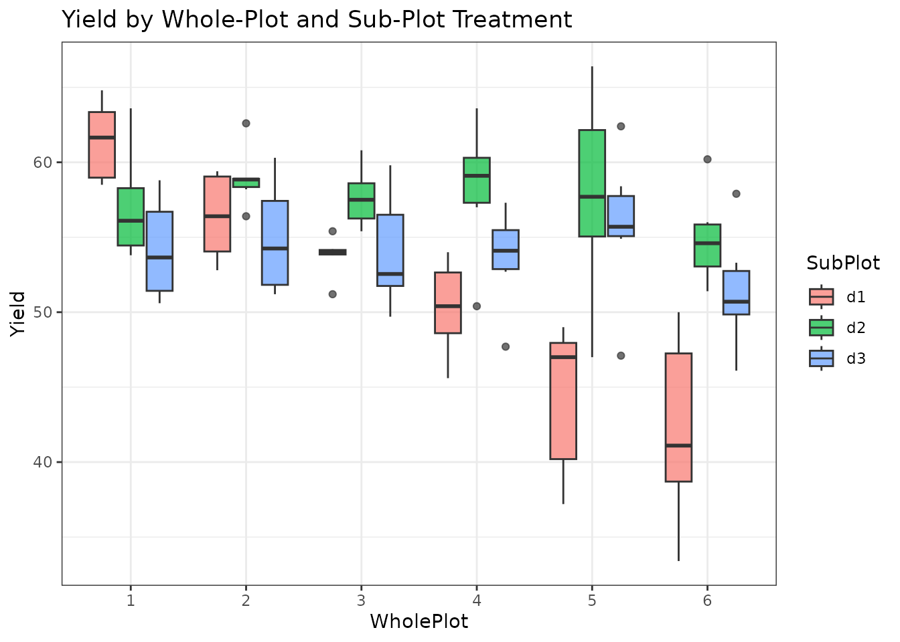
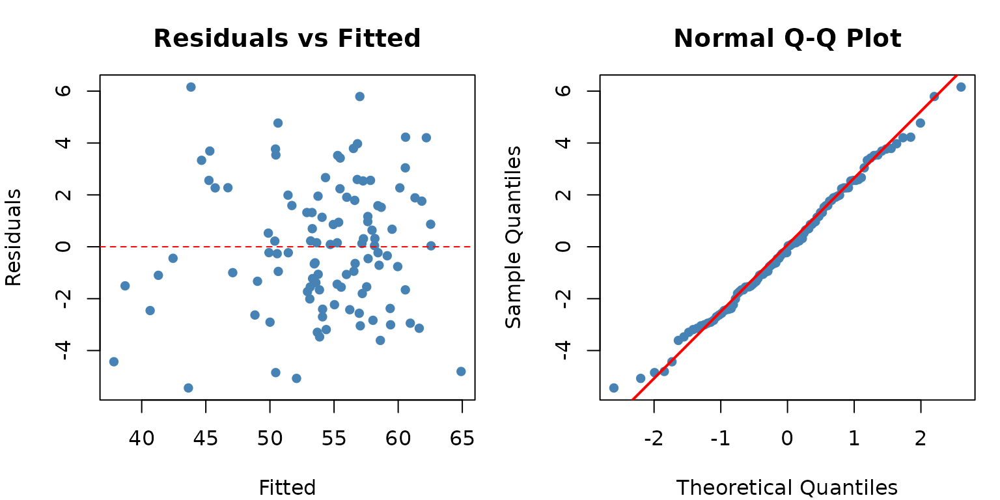
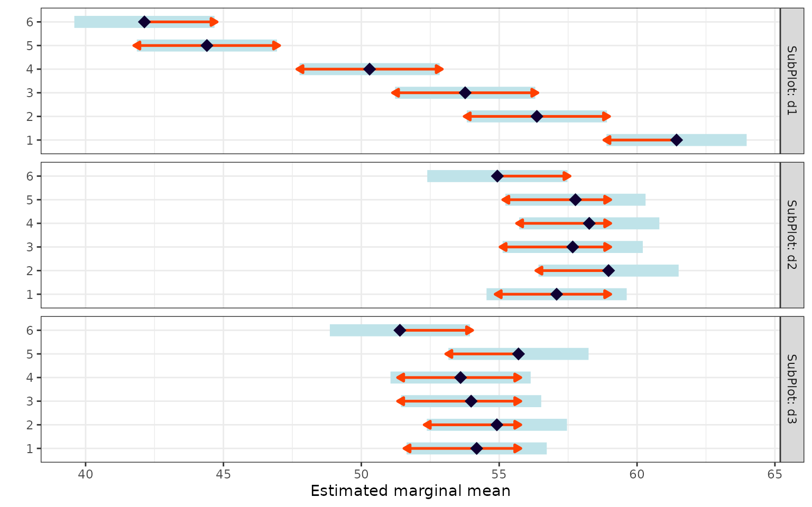
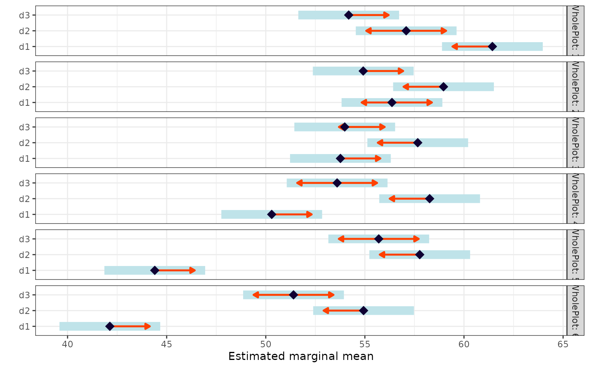
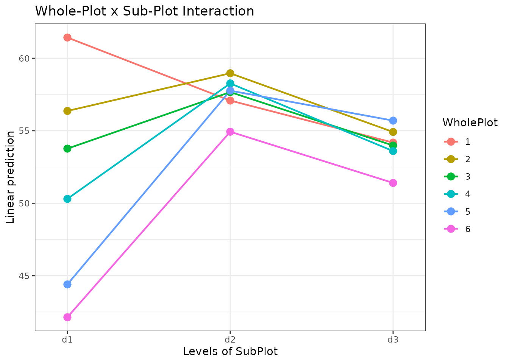
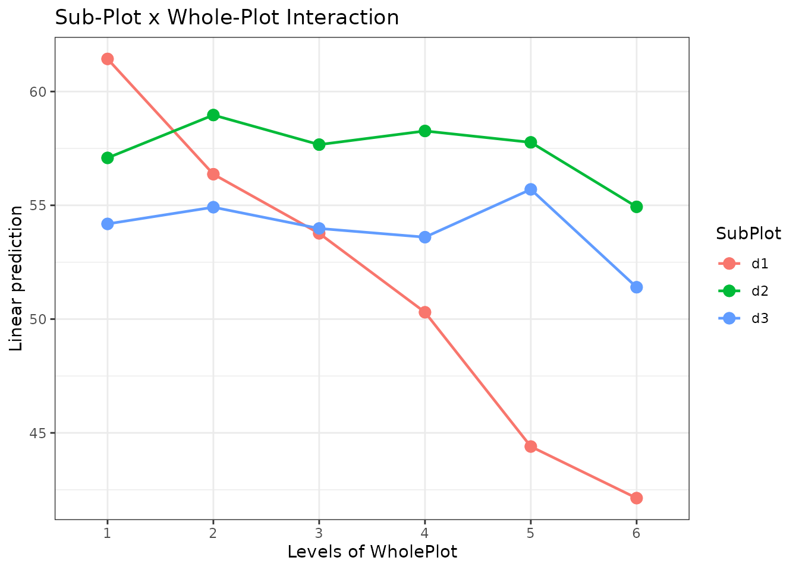

# Split-Plot Design

## When to Use

The **Split-Plot Design** is used when:

- You have **two treatment factors**, but one is harder (or more
  expensive) to change than the other.
- The **whole-plot factor** is applied to larger units, and the
  **sub-plot factor** is applied within those units.
- Randomisation is **restricted**: the whole-plot factor is randomised
  first, then the sub-plot factor is randomised within each whole plot.

Common examples: irrigation method (whole-plot) x fertilizer type
(sub-plot), or tillage system (whole-plot) x crop variety (sub-plot).

## The Design

The split-plot design has **two error terms**:

$$Y_{ijk} = \mu + R_{k} + A_{i} + \delta_{ik} + B_{j} + (AB)_{ij} + \varepsilon_{ijk}$$

where:

- $R_{k}$ = replicate (block) effect
- $A_{i}$ = whole-plot treatment effect
- $\delta_{ik} \sim N\left( 0,\sigma_{\delta}^{2} \right)$ = whole-plot
  error
- $B_{j}$ = sub-plot treatment effect
- $(AB)_{ij}$ = interaction
- $\varepsilon_{ijk} \sim N\left( 0,\sigma^{2} \right)$ = sub-plot error

This requires a **mixed model** because the whole-plot error is a random
effect.

## Data

We use a dataset with 6 whole-plot treatments, 3 sub-plot treatments,
and 6 replicates.

``` r
library(agrideshr)
data(split_plot_data)
str(split_plot_data)
#> Classes 'tbl_df', 'tbl' and 'data.frame':    108 obs. of  4 variables:
#>  $ Replicate: Factor w/ 6 levels "X1","X2","X3",..: 1 2 3 4 5 6 1 2 3 4 ...
#>  $ WholePlot: Factor w/ 6 levels "1","2","3","4",..: 1 1 1 1 1 1 1 1 1 1 ...
#>  $ SubPlot  : Factor w/ 3 levels "d1","d2","d3": 1 1 1 1 1 1 2 2 2 2 ...
#>  $ Yield    : num  58.6 64.8 63.2 58.5 60.1 63.4 54.6 53.8 54.4 57.6 ...
head(split_plot_data, 12)
#>    Replicate WholePlot SubPlot Yield
#> 1         X1         1      d1  58.6
#> 2         X2         1      d1  64.8
#> 3         X3         1      d1  63.2
#> 4         X4         1      d1  58.5
#> 5         X5         1      d1  60.1
#> 6         X6         1      d1  63.4
#> 7         X1         1      d2  54.6
#> 8         X2         1      d2  53.8
#> 9         X3         1      d2  54.4
#> 10        X4         1      d2  57.6
#> 11        X5         1      d2  63.6
#> 12        X6         1      d2  58.5
```

## Exploratory Visualization

``` r
library(ggplot2)

ggplot(split_plot_data, aes(x = WholePlot, y = Yield, colour = SubPlot,
                             group = SubPlot)) +
  geom_line() +
  facet_wrap(~ Replicate) +
  theme_bw() +
  labs(title = "Yield by Whole-Plot and Sub-Plot Treatment (by Replicate)")
```



``` r
ggplot(split_plot_data, aes(x = WholePlot, y = Yield, fill = SubPlot)) +
  geom_boxplot(alpha = 0.7) +
  theme_bw() +
  labs(title = "Yield by Whole-Plot and Sub-Plot Treatment")
```



## Model Fitting

Unlike the previous designs, split-plot requires a **linear mixed
model** using [`lmer()`](https://rdrr.io/pkg/lmerTest/man/lmer.html)
from the `lmerTest` package. The term `(1 | Replicate:WholePlot)`
captures the whole-plot error:

``` r
library(lmerTest)

fit <- lmer(Yield ~ Replicate + WholePlot * SubPlot + (1 | Replicate:WholePlot),
            data = split_plot_data)
```

### ANOVA Table

``` r
anova(fit)
#> Type III Analysis of Variance Table with Satterthwaite's method
#>                   Sum Sq Mean Sq NumDF DenDF F value    Pr(>F)    
#> Replicate         423.44   84.69     5    25  10.019 2.359e-05 ***
#> WholePlot         530.26  106.05     5    25  12.547 3.705e-06 ***
#> SubPlot           663.31  331.66     2    60  39.238 1.269e-11 ***
#> WholePlot:SubPlot 942.58   94.26    10    60  11.152 1.839e-10 ***
#> ---
#> Signif. codes:  0 '***' 0.001 '**' 0.01 '*' 0.05 '.' 0.1 ' ' 1
```

The F-tests use appropriate denominator degrees of freedom:

- **WholePlot** is tested against the whole-plot error.
- **SubPlot** and **WholePlot:SubPlot** are tested against the sub-plot
  (residual) error.

### Variance Components

``` r
VarCorr(fit)
#>  Groups              Name        Std.Dev.
#>  Replicate:WholePlot (Intercept) 1.1544  
#>  Residual                        2.9073
```

## Assumption Checking

For mixed models, we check residuals at the sub-plot level:

``` r
resid_vals <- residuals(fit)
fitted_vals <- fitted(fit)

par(mfrow = c(1, 2), mar = c(4, 4, 3, 1))
plot(fitted_vals, resid_vals,
     xlab = "Fitted", ylab = "Residuals",
     main = "Residuals vs Fitted", pch = 16, col = "steelblue")
abline(h = 0, lty = 2, col = "red")

qqnorm(resid_vals, main = "Normal Q-Q Plot", pch = 16, col = "steelblue")
qqline(resid_vals, col = "red", lwd = 2)
```



``` r
shapiro.test(resid_vals)
#> 
#>  Shapiro-Wilk normality test
#> 
#> data:  resid_vals
#> W = 0.99214, p-value = 0.7939
```

## Post-hoc Comparisons

### Estimated Marginal Means

#### Whole-plot treatment within each sub-plot level

``` r
library(emmeans)

emm_a <- emmeans(fit, ~ WholePlot | SubPlot)
pairs(emm_a)
#> SubPlot = d1:
#>  contrast                estimate   SE   df t.ratio p.value
#>  WholePlot1 - WholePlot2    5.067 1.81 78.6   2.805  0.0671
#>  WholePlot1 - WholePlot3    7.667 1.81 78.6   4.245  0.0008
#>  WholePlot1 - WholePlot4   11.133 1.81 78.6   6.165 <0.0001
#>  WholePlot1 - WholePlot5   17.033 1.81 78.6   9.431 <0.0001
#>  WholePlot1 - WholePlot6   19.300 1.81 78.6  10.686 <0.0001
#>  WholePlot2 - WholePlot3    2.600 1.81 78.6   1.440  0.7029
#>  WholePlot2 - WholePlot4    6.067 1.81 78.6   3.359  0.0148
#>  WholePlot2 - WholePlot5   11.967 1.81 78.6   6.626 <0.0001
#>  WholePlot2 - WholePlot6   14.233 1.81 78.6   7.881 <0.0001
#>  WholePlot3 - WholePlot4    3.467 1.81 78.6   1.920  0.3982
#>  WholePlot3 - WholePlot5    9.367 1.81 78.6   5.186 <0.0001
#>  WholePlot3 - WholePlot6   11.633 1.81 78.6   6.441 <0.0001
#>  WholePlot4 - WholePlot5    5.900 1.81 78.6   3.267  0.0194
#>  WholePlot4 - WholePlot6    8.167 1.81 78.6   4.522  0.0003
#>  WholePlot5 - WholePlot6    2.267 1.81 78.6   1.255  0.8081
#> 
#> SubPlot = d2:
#>  contrast                estimate   SE   df t.ratio p.value
#>  WholePlot1 - WholePlot2   -1.883 1.81 78.6  -1.043  0.9019
#>  WholePlot1 - WholePlot3   -0.583 1.81 78.6  -0.323  0.9995
#>  WholePlot1 - WholePlot4   -1.183 1.81 78.6  -0.655  0.9862
#>  WholePlot1 - WholePlot5   -0.683 1.81 78.6  -0.378  0.9990
#>  WholePlot1 - WholePlot6    2.150 1.81 78.6   1.190  0.8401
#>  WholePlot2 - WholePlot3    1.300 1.81 78.6   0.720  0.9790
#>  WholePlot2 - WholePlot4    0.700 1.81 78.6   0.388  0.9988
#>  WholePlot2 - WholePlot5    1.200 1.81 78.6   0.664  0.9853
#>  WholePlot2 - WholePlot6    4.033 1.81 78.6   2.233  0.2346
#>  WholePlot3 - WholePlot4   -0.600 1.81 78.6  -0.332  0.9994
#>  WholePlot3 - WholePlot5   -0.100 1.81 78.6  -0.055  1.0000
#>  WholePlot3 - WholePlot6    2.733 1.81 78.6   1.513  0.6567
#>  WholePlot4 - WholePlot5    0.500 1.81 78.6   0.277  0.9998
#>  WholePlot4 - WholePlot6    3.333 1.81 78.6   1.846  0.4431
#>  WholePlot5 - WholePlot6    2.833 1.81 78.6   1.569  0.6212
#> 
#> SubPlot = d3:
#>  contrast                estimate   SE   df t.ratio p.value
#>  WholePlot1 - WholePlot2   -0.733 1.81 78.6  -0.406  0.9985
#>  WholePlot1 - WholePlot3    0.200 1.81 78.6   0.111  1.0000
#>  WholePlot1 - WholePlot4    0.583 1.81 78.6   0.323  0.9995
#>  WholePlot1 - WholePlot5   -1.517 1.81 78.6  -0.840  0.9591
#>  WholePlot1 - WholePlot6    2.783 1.81 78.6   1.541  0.6391
#>  WholePlot2 - WholePlot3    0.933 1.81 78.6   0.517  0.9954
#>  WholePlot2 - WholePlot4    1.317 1.81 78.6   0.729  0.9778
#>  WholePlot2 - WholePlot5   -0.783 1.81 78.6  -0.434  0.9980
#>  WholePlot2 - WholePlot6    3.517 1.81 78.6   1.947  0.3819
#>  WholePlot3 - WholePlot4    0.383 1.81 78.6   0.212  0.9999
#>  WholePlot3 - WholePlot5   -1.717 1.81 78.6  -0.951  0.9318
#>  WholePlot3 - WholePlot6    2.583 1.81 78.6   1.430  0.7085
#>  WholePlot4 - WholePlot5   -2.100 1.81 78.6  -1.163  0.8530
#>  WholePlot4 - WholePlot6    2.200 1.81 78.6   1.218  0.8267
#>  WholePlot5 - WholePlot6    4.300 1.81 78.6   2.381  0.1757
#> 
#> Results are averaged over the levels of: Replicate 
#> Degrees-of-freedom method: kenward-roger 
#> P value adjustment: tukey method for comparing a family of 6 estimates
```

``` r
plot(emm_a, comparisons = TRUE) +
  theme_bw() +
  labs(y = "", x = "Estimated marginal mean")
```



#### Sub-plot treatment within each whole-plot level

``` r
emm_b <- emmeans(fit, ~ SubPlot | WholePlot)
pairs(emm_b)
#> WholePlot = 1:
#>  contrast estimate   SE df t.ratio p.value
#>  d1 - d2     4.350 1.68 60   2.592  0.0317
#>  d1 - d3     7.250 1.68 60   4.319  0.0002
#>  d2 - d3     2.900 1.68 60   1.728  0.2033
#> 
#> WholePlot = 2:
#>  contrast estimate   SE df t.ratio p.value
#>  d1 - d2    -2.600 1.68 60  -1.549  0.2757
#>  d1 - d3     1.450 1.68 60   0.864  0.6650
#>  d2 - d3     4.050 1.68 60   2.413  0.0489
#> 
#> WholePlot = 3:
#>  contrast estimate   SE df t.ratio p.value
#>  d1 - d2    -3.900 1.68 60  -2.323  0.0602
#>  d1 - d3    -0.217 1.68 60  -0.129  0.9909
#>  d2 - d3     3.683 1.68 60   2.194  0.0803
#> 
#> WholePlot = 4:
#>  contrast estimate   SE df t.ratio p.value
#>  d1 - d2    -7.967 1.68 60  -4.746 <0.0001
#>  d1 - d3    -3.300 1.68 60  -1.966  0.1295
#>  d2 - d3     4.667 1.68 60   2.780  0.0196
#> 
#> WholePlot = 5:
#>  contrast estimate   SE df t.ratio p.value
#>  d1 - d2   -13.367 1.68 60  -7.963 <0.0001
#>  d1 - d3   -11.300 1.68 60  -6.732 <0.0001
#>  d2 - d3     2.067 1.68 60   1.231  0.4396
#> 
#> WholePlot = 6:
#>  contrast estimate   SE df t.ratio p.value
#>  d1 - d2   -12.800 1.68 60  -7.626 <0.0001
#>  d1 - d3    -9.267 1.68 60  -5.521 <0.0001
#>  d2 - d3     3.533 1.68 60   2.105  0.0973
#> 
#> Results are averaged over the levels of: Replicate 
#> Degrees-of-freedom method: kenward-roger 
#> P value adjustment: tukey method for comparing a family of 3 estimates
```

``` r
plot(emm_b, comparisons = TRUE) +
  theme_bw() +
  labs(y = "", x = "Estimated marginal mean")
```



### Interaction Plots

``` r
emmip(fit, WholePlot ~ SubPlot) +
  theme_bw() +
  labs(title = "Whole-Plot x Sub-Plot Interaction")
```



``` r
emmip(fit, SubPlot ~ WholePlot) +
  theme_bw() +
  labs(title = "Sub-Plot x Whole-Plot Interaction")
```



## Conclusion

The split-plot design is essential when practical constraints prevent
full randomisation of all treatment combinations. Key points:

1.  **Mixed model** is required (`lmer`, not `aov`) to correctly
    partition the two error terms.
2.  The whole-plot factor is tested with **less precision** (fewer
    effective replicates) than the sub-plot factor.
3.  **emmeans** with conditional contrasts (`~ A | B`) is the
    appropriate way to make pairwise comparisons.

## Design Summary

| Design       | Vignette                                                               | Factors       | Blocking           | Model                       |
|--------------|------------------------------------------------------------------------|---------------|--------------------|-----------------------------|
| CRD          | [01](https://emantzoo.github.io/agrideshr/articles/01-crd.md)          | 1             | None               | `aov(Y ~ A)`                |
| RCBD         | [02](https://emantzoo.github.io/agrideshr/articles/02-rcbd.md)         | 1 + Block     | 1 blocking factor  | `aov(Y ~ Block + A)`        |
| Latin Square | [03](https://emantzoo.github.io/agrideshr/articles/03-latin-square.md) | 1 + Row + Col | 2 blocking factors | `aov(Y ~ Row + Col + A)`    |
| Factorial    | [04](https://emantzoo.github.io/agrideshr/articles/04-factorial.md)    | 2+ crossed    | Optional           | `aov(Y ~ A * B)`            |
| Split-Plot   | [05](https://emantzoo.github.io/agrideshr/articles/05-split-plot.md)   | 2 nested      | Replicates         | `lmer(Y ~ A*B + (1|Rep:A))` |
